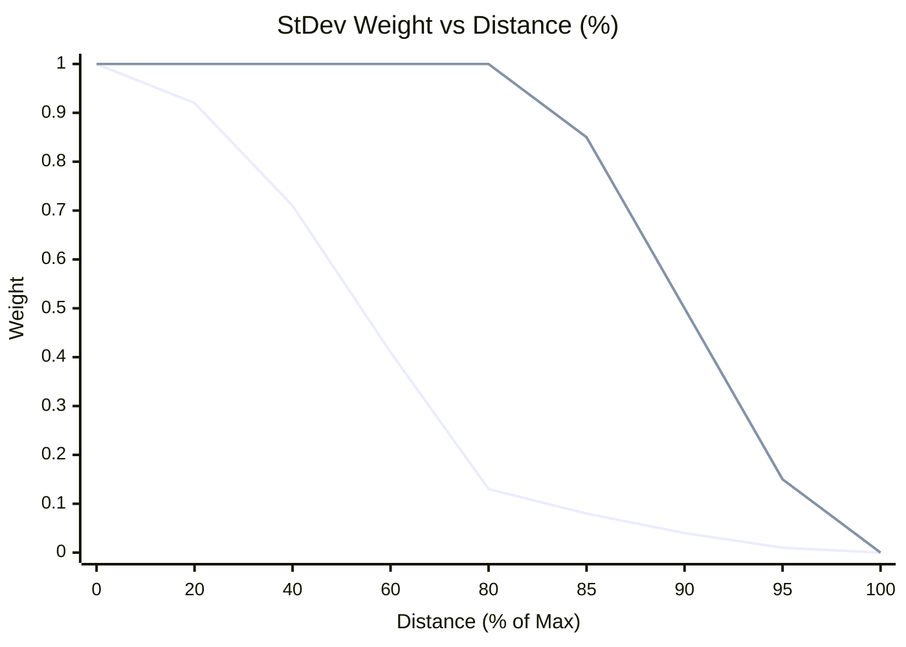

# Variability Smoothing Functions

To calculate the Moving Standard Deviation (Variability), we define a "neighborhood" distance (Max Distance). But if we just abruptly clip the data at `distance = max`, the Standard Deviation calculation would experience sharp, unnatural jumps as points enter or leave the moving boundary. 

To solve this, we apply a weighting kernel that smooths out the edges.

### Old Function: Bisquare Kernel
Previously, we used a continuous decay function called the **Bisquare Kernel**. 
* **Formula**: $W = (1 - (\frac{d}{d_{max}})^2)^2$ 
* **Issue**: This function drops off continuously right from distance 0. Because of this, it can artificially suppress the influence of highly variable points unless they are extremely close to the center. So, as you correctly pointed out, this was likely **underestimating the true local variability**.

### New Function: Flat-top Tukey Taper
We have replaced the bisquare kernel with a flat-top window (specifically, an 80% Tukey Taper). 
* **Formula**: 
  - For $d < 0.8 \times d_{max}$, Weight = 1
  - For $d > 0.8 \times d_{max}$, Weight smoothly blends to 0 using a cosine wave.
* **Benefit**: With the new taper, the calculation operates at **100% full strength** out to 80% of your chosen maximum distance boundary. After 80%, it initiates a rapid but mathematically smooth `cosine()` taper down to exactly zero at the 100% boundary limit. 

This ensures your variance calculations aren't artificially down-weighted, while still avoiding any sharp visual artifacts and jumps!

## Graphical Comparison

